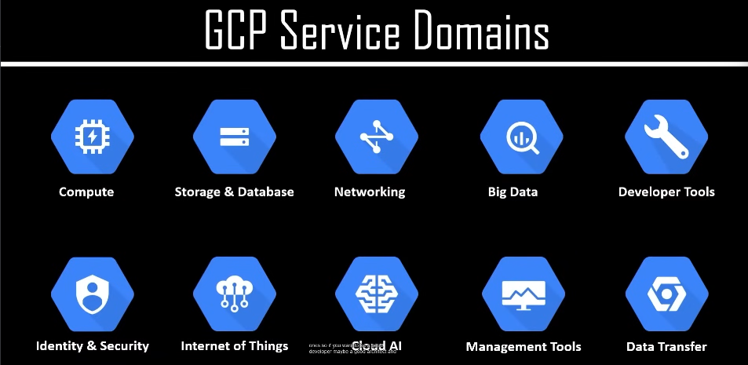
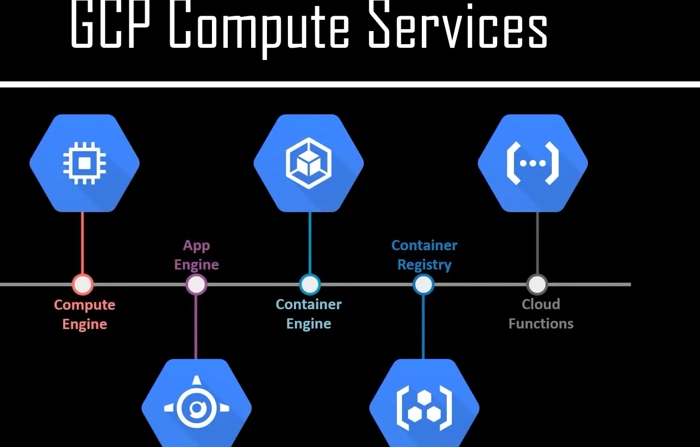
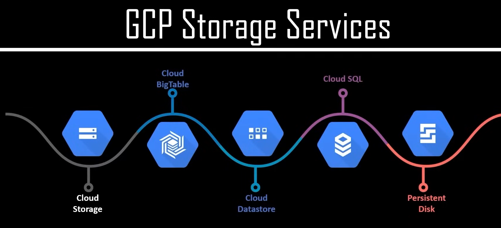
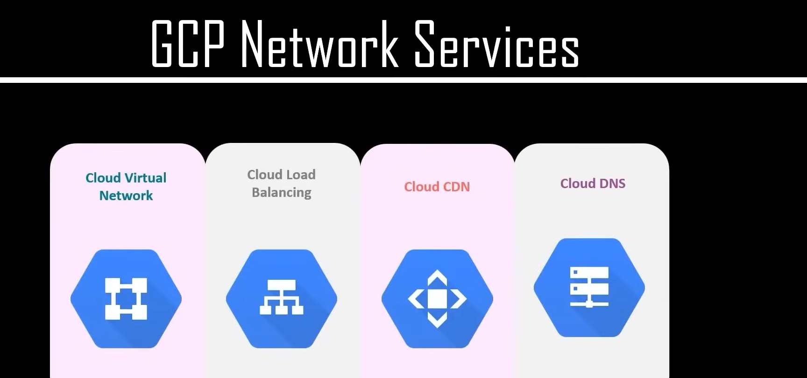
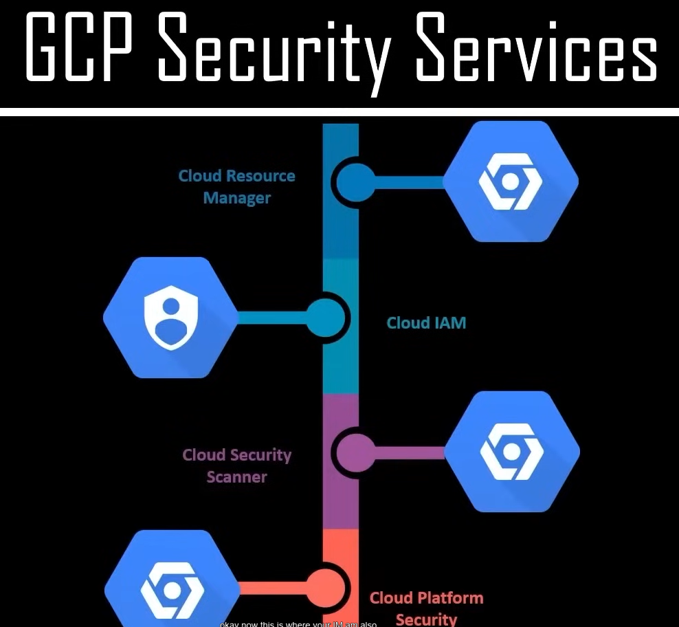

1.)GCP Service Domains:

2.)GCP Compute Services:

3.)GCP Storage Services:

*Cloud Storage (General Storage)

-Like Google Drive for businesses.

-Stores files, images, videos, backups.

-Good for scalable and cost-effective storage.

*Cloud BigTable (NoSQL Database)

-A fast database for large-scale applications.

-Used in analytics, IoT, machine learning.

-Stores millions of records efficiently.

*Cloud Datastore (NoSQL Database for Apps)

-Designed for web and mobile apps.

-Stores structured data like users, orders, messages.

Automatically scales as apps grow.

*Cloud SQL (Managed SQL Database)

-Like MySQL, PostgreSQL, SQL Server, but managed by Google.

-Great for websites, ERP systems, and business apps.

-Google handles backups, updates, security.

*Persistent Disk (Storage for Virtual Machines)

-Works like a hard drive for cloud computers.

-Used with Compute Engine VMs.

-Keeps data even if the VM is restarted.

4.)GCP Network Services:

*Cloud Virtual Network

-Creates a private network for your cloud resources.

-Connects virtual machines, databases, and other services securely.

*Cloud Load Balancing:

-Distributes traffic across multiple servers.

-Ensures applications remain fast and available even during high traffic.

*Cloud CDN (Content Delivery Network):

-Caches content closer to users for faster website loading.

-Reduces latency and improves user experience.

*Cloud DNS:

-A highly scalable domain name system (DNS) service.

-Translates domain names (e.g., google.com) into IP addresses to reach the correct servers.

5.)GCP Security Services:

1.Cloud Resource Manager
Helps organize and manage cloud resources, including projects, folders, and organizations.
Enables setting up policies and permissions to control access.

2. Cloud IAM (Identity and Access Management)
Manages who has access to GCP resources and what actions they can perform.
Supports role-based access control (RBAC) and fine-grained permissions.

3. Cloud Security Scanner
Scans web applications running on GCP for security vulnerabilities.
Detects issues like cross-site scripting (XSS), outdated libraries, and exposed APIs.

4. Cloud Platform Security
Provides comprehensive security solutions for workloads running on GCP.
Includes features like encryption, data loss prevention (DLP), and security monitoring.
