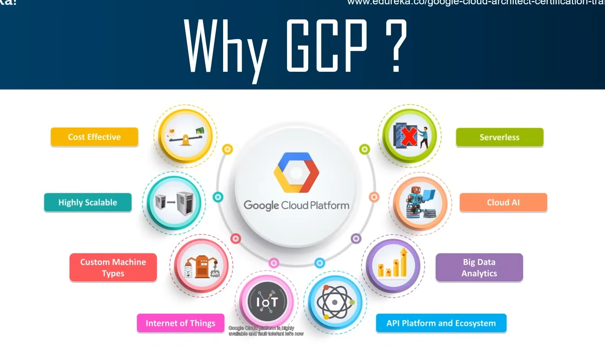

1.)what is Google Cloud Platform (GCP)?

Google Cloud Platform (GCP) is a collection of cloud computing services offered by Google, allowing businesses and developers to store, manage, and analyze data, and build, deploy, and scale applications on Google's infrastructure. AND also 20% cheaper than AWS.

2.)Why we should prefer GCP?

3.)Advantages of GCP?

