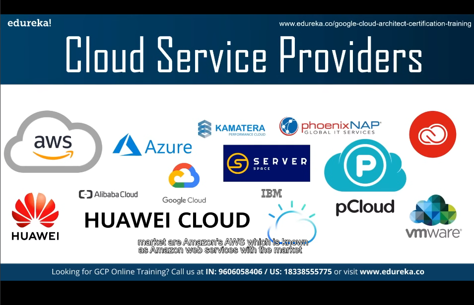

1.) What is Cloud Computing?

cloud computing means storing and accessing data and programs over the internet, rather than on your computer's hard drive or a physical server.

2.) Major cloud services providers:
   
   

3.) Uses of Cloud:

 